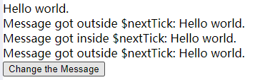

#$nextTick
```html
<div class="app">
	<div ref="msgDiv">{{msg}}</div>
	<div v-if="msg1">Message got outside $nextTick: {{msg1}}</div>
	<div v-if="msg2">Message got inside $nextTick: {{msg2}}</div>
	<div v-if="msg3">Message got outside $nextTick: {{msg3}}</div>
	<button @click="changeMsg">
		Change the Message
	</button>
</div>
```
```javascript
data: {
   msg: 'Hello Vue.',
   msg1: '',
   msg2: '',
   msg3: ''
 },
methods: {
   changeMsg() {
     this.msg = "Hello world."
     this.msg1 = this.$refs.msgDiv.innerHTML
     this.$nextTick(() => {
       this.msg2 = this.$refs.msgDiv.innerHTML
     })
     this.msg3 = this.$refs.msgDiv.innerHTML
   }
 }
```
`初始页面展示`

`第一次点击Change the Message`

`第二次点击Change the Message`

- 从图中可以得知：msg1和msg3显示的内容还是变换之前的，而msg2显示的内容是变换之后的。其根本原因是因为Vue中DOM更新是异步的

参考：[enter link description here](https://www.jianshu.com/p/a7550c0e164f)


