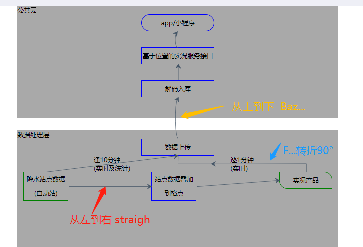
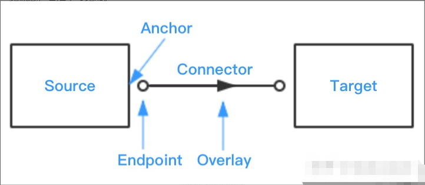
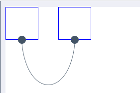

# jsPlumb

**jsPlumb安装**
```
npm install jsplumb --save
//项目引入：
import jsPlumb from 'jsplumb';
Vue.prototype.$jsPlumb = jsPlumb.jsPlumb;
```

**jsPlumb基本概念**
> Source: 源对象。jsPlumb 通过元素的 id 属性获取对象。
> Target: 目标对象。jsPlumb 通过元素的 id 属性获取对象。
- Source 和 Target 都可以是任何元素，区别是，Source 是起点，Target 是终点。 例如，connector 中的箭头总是从 Source 指向 Target。

>  Anchor：锚点。是 Source 和 Target 对象上可以连接 Connector 的点。Anchor 并不是一个视觉概念，它是不可见的。
>  Connector: 连接线。
- straight(直线)  Bezier(贝塞尔曲线)，默认  flowchart(具有90度转折点的流程线、流程图)  state machine(状态机)
```
1.straight
connector: ['Straight', {
  gap: 0,
  cornerRadius: 1,
  alwaysRespectStubs: true
}],
// gap：可选，默认为0px。在连接线的一端和连接的元素之间指定一个间隙。
anchor: ['Top', 'Bottom'], //上到下

2.Bezier
connector: ['Bezier', { curviness: 2 }], 
// curviness：可选，默认为150px。定义了曲线的弯曲程度
anchor: ['Left', 'Right'], //左到右

3.flowchart
connector: ['Flowchart', { curviness: 2 }],
anchor: ['Top', 'Bottom'],
```

>  Endpoint: 端点。注意，箭头并不是一种端点样式，它是通过 overlay 添加的。
-  Endpoint: 端点：设置了连接器的源和目标端点的形状 Dot(点)  Rectangle(矩形)  Blank(空)  image(图像)

>  Overlay: 添加到连接线上的附件。连接线和端点的遮罩层样式，装饰连接器，如标签、箭头等。
>  Overlay有五个覆盖类型
-  1.Arrow(箭头) ：沿连接器某点绘制的可配置箭头。可以控制箭头的长度和宽度，'折返'点 - 尾点折回的点和方向（允许值为1和-1; 1是默认值，表示指向连接的方向）
-  2.Label(标签)：在连接器的某个点上绘制的可配置标签
-  3.PlainArrow(平原箭头)：箭头形状为三角形，没有折返
-  4.Diamond(钻石)：钻石箭头
-  5.Custom(自定义)：可自定义DOM元素




**jsPlumb Events列表**
- 1.要在jsPlumb本身（或jsPlumb实例）上绑定事件，请使用jsPlumb.bind(event, callback)
```
jsPlumb.bind("connection", function(info) {
   .. update your model in here, maybe.
});
```
- 2.在jsPlumb类上绑定的事件：connection（info, originalEvent）- 通知连接建立
- 3.connectionDetached（info，originalEvent）- 通知连接断开
- 4.connectionMoved（info，originalEvent）- 通知已将现有连接的源或目标端点拖动到某个新位置
- 5.connectionAborted（connection，originalEvent）在连接到端点或目标元素之前放弃拖动连接时触发
- 6.connectionDrag（connection）- 正在拖动现有连接`注：当此事件触发时，连接的目标端点是jsPlumb用于拖动的瞬态元素，随后在建立或中止连接时将从DOM中删除`
- 7.connectionDragStop（connection）- 连接拖动结束
- 8.click（connection, originalEvent）- 单击连接
- 9.dblclick（connection, originalEvent）- 双击连接
- 10.endpointClick（connection, originalEvent）- 单击端点
- 11.endpointDblClick（connection, originalEvent）- 双击端点
- 12.contextmenu（connection, originalEvent）- 右键单击某个给定组件jsPlumb将报告对
- 13.Connections和Endpoints的右键单击
- 14.beforeDrop（info）- 删除新连接或现有连接时触发此事件
- 15.beforeDetach（connection）- 断开连接时触发此事件。connection参数为刚断开的
beforeDrag（connection）- 开始拖动新连接时触发此事件。
- 16.Connection。如果此拦截器返回false将会中止连接断开。
- 17.beforeDrag（connection）- 开始拖动新连接时触发此事件。(beforeDrag与其他拦截器的操作略有不同：从拦截器函数返回false将取消当前拖动，也可以从拦截器返回一个对象，此对象将作为data被传进新连接的构造函数中)
```
jsPlumbInstance.bind("beforeDrag", function(params) {
  return {
   foo:"bar"
  }
});
```
- 18.beforeStartDetach（connection）- 开始拖动现有连接时触发此事件。

**连接事件：绑定到Connection上的事件，还可以使用以下bind方法：**
```
var connection = jsPlumb.connect({source:"d1", target:"d2"});
connection.bind("click", function(conn) {
    console.log("you clicked on ", conn);
});
```
> 以下是可以绑定的连线事件：
> click(connection, originalEvent) - 单击连接。
> dblclick(connection, originalEvent) - 双击连接。
> contextmenu(connection, originalEvent) - 右键单击​​连线。
> mouseover(connection, originalEvent) - 鼠标放在连线上。
> mouseout(connection, originalEvent) - 鼠标移出连线。
> mousedown(connection, originalEvent) - 连接上的鼠标按钮被按下。
> mouseup(connection, originalEvent) - 连接上的鼠标按钮被释放。

**端点事件：绑定到端点上的事件，使用以下bind方法：**
```
var endpoint = jsPlumb.addEndpoint("d1", { someOptions } );
endpoint.bind("click", function(endpoint) {
    console.log("you clicked on ", endpoint);
});
```
> 以下是可以绑定的连线事件：
> click(endpoint, originalEvent) - 单击端点。
>dblclick(endpoint, originalEvent) - 双击端点。
>contextmenu(endpoint, originalEvent) - 右键单击​​端点。
>mouseover(endpoint, originalEvent) - 鼠标放在端点上。
>mouseout(endpoint, originalEvent) - 鼠标移出端点。
>mousedown(endpoint, originalEvent) - 端点上的鼠标按钮被按下。
>mouseup(endpoint, originalEvent) - 端点上鼠标按钮被释放。
>maxConnections(info, originalEvent) - 在已具有最大连接数的端点上删除连接

**覆盖事件：在Overlay上注册事件侦听器是一个稍微不同的过程 - 将它们作为Overlay构造函数的参数。以下是在Overlay上注册点击监听器的方法：**
```
jsPlumb.connect({
	source:"el1",
	target:"el2",
	overlays:[
	[ "Label", {
		events:{
			click:function(labelOverlay, originalEvent) { 
			console.log("click on label overlay for :" + labelOverlay.component); 
			}
		}
	}],
	[ "Diamond", {
		events:{
			dblclick:function(diamondOverlay, originalEvent) { 
			console.log("double click on diamond overlay for : " + diamondOverlay.component); 
			}
		}
	}]    
	]
});
```


**解除绑定事件：在jsPlumb对象以及Connections和Endpoints上，可以使用unbind方法删除监听器。**
```
//取消绑定事件
jsPlumb.unbind("click");
或者//解除所有事件
var e = jsPlumb.addEndpoint("someDiv");
e.bind("click", function() { ... });
e.bind("dblclick", function() { ... });
...
e.unbind("click");
```

**jsplumb 的  eg: 链接两个节点并且可以拖动**
```html
<div id="diagramContainer">
	<div id="item_left" class="item"></div>
	<div id="item_right" class="item" style="left:150px;"></div>
</div>
```
```javascript
mounted() {
 jsPlumb.ready(function () {
   jsPlumb.connect({
     source: 'item_left', 
     target: 'item_right', 
     endpoint: 'Dot', //圆点 Rectangle //正方形  Blank //空白
     overlays: [
		"Arrow",
		["Label", { label: "foo", location: 0.25, id: "myLabel" }]
	],
	connector: ['Flowchart'],
   })
    jsPlumb.draggable('item_left')
    jsPlumb.draggable('item_right')
 })
}
```
```css
.item {
  position: absolute;
  height: 80px;
  width: 80px;
  border: 1px solid blue;
}
```

`注意：使用 jsPlumb.ready() 函数来初始化 jsPlumb，应该把 jsPlumb.ready() 的代码写在 Vue 生命周期的 mounted 钩子中，而不是 created 中，原因是：因为 jsPlumb 是通过 DOM 元素来工作的，而在生命周期中的 created 阶段，Vue 实例还未挂载到页面元素上，这时候我们编写在组件中的元素是不存在的，因此 jsPlumb 无法起作用。`


参考：[enter link description here](https://zhuanlan.zhihu.com/p/41808577)
基本配置参考：[enter link description here](https://www.jianshu.com/p/d68a8e61ff2d?utm_campaign=maleskine&utm_content=note&utm_medium=seo_notes&utm_source=recommendation)
event事件参考:[enter link description here](https://www.jianshu.com/p/c2c4f7fdffa1?utm_campaign=maleskine&utm_content=note&utm_medium=seo_notes&utm_source=recommendation)

https://www.jianshu.com/p/a3cd623cdbb7